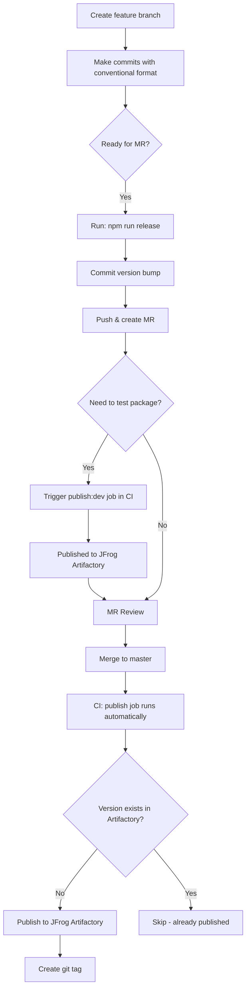

# @angi/one-design-system

This is the unified package for the One Design System. It aggregates all design system packages into a single publishable package with subpath exports.

## Installation

```bash
npm install @angi/one-design-system
```

## Usage

### Tokens

```typescript
import "@angi/one-design-system/tokens/css/angi.css";
```

### Themes

#### Tailwind v3
```typescript
import preset from "@angi/one-design-system/themes/tailwind-v3";
```

#### Tailwind v4
```
@import "@angi/one-design-system/themes/tailwind-v4/theme.css";
```

#### Vanilla Extract

```typescript
import { themeContract } from "@angi/one-design-system/themes/vanilla-extract/contract";
```

### Components

```typescript
import { Button } from "@angi/one-design-system/components/Button";
```

### CSS Reset

```typescript
import "@angi/one-design-system/css-reset/globalReset.css";
```

---

## Contributing

### Commit Message Format

This repo uses [Conventional Commits](https://www.conventionalcommits.org/). All commits must follow this format (enforced by commit-msg hook):

```
<type>(<scope>): <description>
```

| Type | Version Bump | Example |
|------|--------------|---------|
| `feat` | Minor (0.1.0) | `feat: add new Button variant` |
| `fix` | Patch (0.0.1) | `fix: correct padding in Input` |
| `docs`, `chore`, `refactor`, `test`, `ci` | No bump | `docs: update README` |

**Breaking changes:** append `!` (e.g., `feat!: redesign Button API`) → Major bump

### Release Workflow




> View published packages at [JFrog Artifactory](https://angi.jfrog.io/ui/packages)

### Useful Commands

```bash
# Preview what version bump would happen (dry run)
npm run release:dry-run

# Bump version based on commits
npm run release
```

> **Note:** Publishing is handled automatically by CI. Do not run `npm run release:publish` locally.
